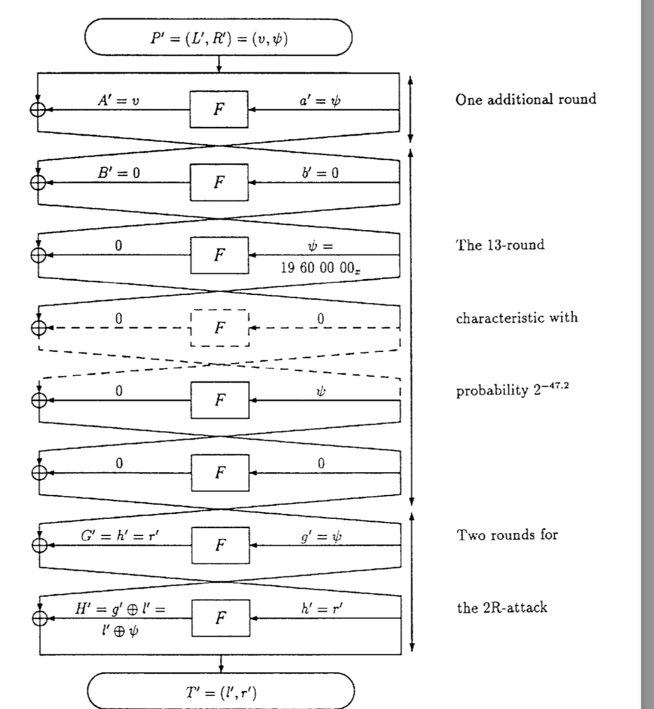
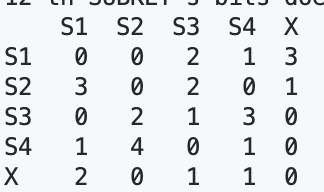

# DES 12라운드에 DC 공격 시도해보기

우선 처음에는 11라운드로 시도를 해보았지만, 해보면서 느낀 점중 하나는 암호문과 평문에서 SBOX의 입력 차분이 0이 아닌경우가 많아야 적어도 key의 후보군을 털어낼 가능성이 높아진다는 것이다. 그러므로 11라운드보다 12라운드 공격이 더 공격에 유리할 것이라 여겼다. 우선 11라운드는 12라운드보다 마지막 라운드의 S1 ~ S8의 입력 차분이 0이 아닌경우가 많아서 이를 통해 많은 key 후보를 알아낼 수 있다고 생각했기 때문이다.

## 1. 12라운드 차분 경로 구하기

그래서 12라운드 DES에 대해서 DC를 수행해보기로 했다. 전체적인 차분 경로는 논문과 동일하다.

다만 가운데 13라운드 특성이 4라운드 줄어서 9라운드가 됐다는 것이다. 그래서 첫번째 라운드에서 P와 P’이 잘 만나서 두번째 라운드의 오른쪽 절반의 절반의 차분이 0이 된다면 아래 차분경로를 탈 확률은 $({1\over234})^4$ 이다.

그래서 처음에는 structure를 하나 만들기 위해서 평문 하나 임의로 뽑고, 해당 평문에서 0x400개의 평문 variations들을 만든다. 방법은 논문에서 얘기하는 것처럼 Round1 의 S1, S2, S3의 출력에 해당하는 평문의left_block의 비트 위치 12개를 전부 $2^{12}$ 의 경우의 수가 있고 이를 다 바꿔준 $2^{12}$개의 평문 variation들을 만든다. 그리고 이 0x400개의 평문들 $P_i(0≤i≤4095)$의 오른쪽 block에 0x19600000이라는 차분을 더한 평문들 ${P'_i}(0≤i≤4095)$ 0x400도 만들어준다.

그리고 이 0x800개의 평문들의 암호문들을 만들고 $P_i$의 암호문들과 $P'_i$의 암호문들의 조합 $2^{24}$개 중에서 암호문 오른쪽 차분에서 11라운드의 S4 ~ S8 출력 차분들이 permutation을 거친 비트 위치를 알 수 있으므로 해당 값들이 같은 것을 pair로 여기고 R1, R11, R12 의 차분 테이블을 보고 또 안되는 경우를 거른다. 이 때 20bit position은 sorting을 이용하기 위해 비슷한 원리를 적용하는 c++의 vector, sort을 사용해서 검색했다. 원래 해쉬를 이용하려 했으나 왠지 모르게 해쉬가 더 느려서 sorting으로 바꾸었다. (차이가 많이 나지는 않고, 근소한 차이였다.)

이렇게 나온 것들을 right pair, 정확히 얘기하면 right pair 후보들 (살짝 Noise가 끼어있는) 이라고 할 수 있다.

논문에서 다른 점은 논문에서 계산한 결과를 토대로 한다면 논문의 계산법에 의하면 $2^{24}$개의 쌍중 임의로 골라도 20비트 position이 같을 확률은 $2^{-20}$이고, R1, R11, R12에서 안되는 차분이 걸려지는 확률(0.0745)도 계산하면 1.19pair가 나올 것이라고 했는데, 실제로 해보니 100개 정도의 structure에서 10개 정도의 right pair 후보군들이 나오는 것을 확인했다.

그래서 올바른 right pair 나올 확률은 대략 $({1\over234})^4 * 2^{12}*0.1$ 이고 이는 대략 팔백만개의 structrue에 대해서 확인을 해야 right pair 하나 얻을 수 있다는 것이다.

## 2. 키 복구 과정

이제 키 복구를 하는 방법에 대해서는 Round1, Round12 의 SBOX의 입력 차분이 0이 아닌게 R1의 S1, S2, S3가 있고, R12의 S1 ~ S8이 있으므로 left key register를 덜어낼 수 있다. 그리고 이 중에서 Round 12의 key가 얼추 복구가 되면 15라운드의 Sbox입력도 복원이 되서 이를 통해 R11의 S1, S2, S3의 입력 차분도 0이 아니므로 left key register의 키 후보군을 많이 줄일 수 있다. 일단 이를 위해 R1, R12의 S1,S2,S3,S4의 공통 키 비트수를 확인해보면 다음과 같다.

그래서 여기서 left key register키 복구하는 순서는 다음과 같다.

1. Round1 S3 : (23, 19, 12, 4, 26, 8) 번째 left register 복구
2. Round12 S4 : (27, 5, 22) 복구
3. Round12 S2 : (20, 7, 13, 2) 복구
4. Round1 S2 : (3, 0, 15, 6, 21, 10) 복구
5. Round12 S1 : (9, 16, 25) 복구
6. Round12 S3 : (11, 24, 18) 복구
7. Round1 S1 : (14, 17, 1) 복구

이러면 총 28개의 비트, 즉 left key register의 모든 비트가 복구된다.

그리고 이후에는 right register를 복구해야 하는데 우리는 12라운드의 라운드 함수의 출력을 알 수 없다. 왜냐하면 ciphertext left block과 15라운드 right block이라는 우리가 모르는 값을 xor해야하기 때문이다. 

그러나 left key register를 복구해서, 이를 통해 11라운드의 S1, S2, S3 세 개의 Sbox의 키를 알고 이를 통해 11라운드의 입력을 알고 이를 통해 12라운드 함수의 s4, s5, s6, s7의 출력 비트를 부분적으로 알 수 있다.

이를 통해 약간 씩 후보군을 덜어내면 52비트의 키를 찾을 수 있다. 그리고 나머지 4비트는 순수 브루트포싱으로 찾으면 키를 완전히 복구 할 수 있다.

실제로 임의의 키에 대해서 차분경로를 구하면서 키 복구 하는과정을 실제로 수행해 보니 팔백만개의 structure를 확인해야 하고 1분당 2만개의 structure를 확인하므로 이론상 400분 정도 수행이 되고 이는 6~7시간 정도 걸리고 실제로 수행해본 결과 빠르면 1~2시간만에도 키가 복구될 때도 있고, 3~4시간 정도 걸리는 것이 일반적이었다. 

## 3. Signal to Noise

S/N (잘못된 키가 한 번 나왔을 때 올바른 키가 나올 확률)은 이론적으로 다음과 같다.

$$
{(N*P)\over{({(N*M)*\sigma\over{2^{k}}})}} = {2^{k} * P \over M * \sigma} 
$$

$$
k: 키의 비트, P: 필터리을 이론적으로 통과할 확률, M: 실제 평문들이 right pair를 제안할 확률,\sigma: 각 pair가 제안한는 key의 개수
$$

이를 1개의 structure가 제안하는 pair의 개수가 0.1라는 것을 감안하고 이론적 필터링 확률이 $({1\over234})^4$이고 키는 52비트에 대해서 제시한다는 점과 각 pair가 0.84개의 키를 제안한다는 점은 논문과 동일하니 이론상 S/N은 $2^{35}$이다. 이렇게 S/N이 높은 이유는 논문에서 얘기한 것처럼 마지막 2라운드를 복구한 left key register로 실행함으로써 키의 선택 범위 $1\over2^{12}$ 줄일 수 있다고 한다.

## 4. 마무리

위의 모든 과정은 [https://github.com/doslahtm/DES_12R_DC](https://github.com/doslahtm/DES_12R_DC) 에서 확인할 수 있다.